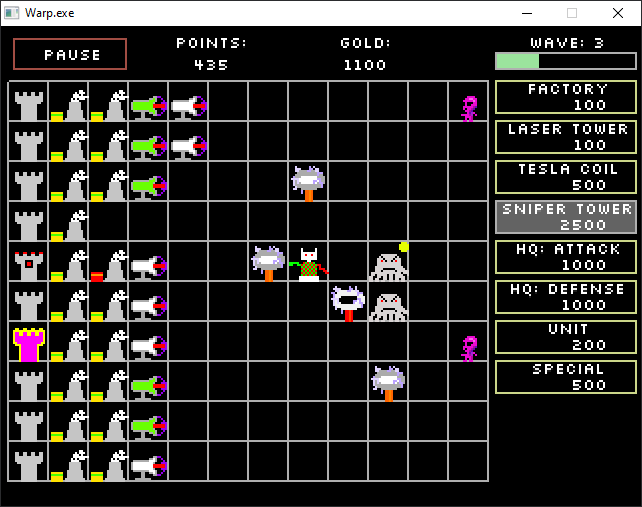

WARP
====

A game of few colors and many challenges.

Created as a 12-week group project for ELTE's Software Technology course.

Building
--------

CMake is used to build the game itself.  
Currently only Windows is supported, but Linux support or other platforms should be fairly straightforward to add.

To clone the repository, use ``git clone --recurse-submodule``.

Credits
-------

 * Game logic, QA testing: [Baffy Benjamin](https://github.com/BenjaminBaffy)
 * Backend, infrastructure: [Discookie](https://github.com/Discookie)
 * Graphics, UX, Testing: [Poór Boldizsár](https://github.com/boldar99)

Licenses
--------

The game's code (located in `src` and `test` folders) is licensed under either of

 * Apache License, Version 2.0, ([LICENSE-APACHE](LICENSE-APACHE) or http://www.apache.org/licenses/LICENSE-2.0)
 * MIT license ([LICENSE-MIT](LICENSE-MIT) or http://opensource.org/licenses/MIT)

The game's graphical assets (located in the `assets` folder, except the fonts) are licensed under Creative Commons Attribution 4.0 license ([LICENSE-CC-BY](LICENSE-CC-BY) or https://creativecommons.org/licenses/by/4.0/)

Used libraries:

 * Allegro Graphics Framework ([license](libs/allegro/LICENSE.txt))
 * Gtest testing framework ([license](libs/googletest/LICENSE))
 * Neither ([license](LICENSE.txt))
 * Silkscreen font ([license](https://kottke.org/plus/type/silkscreen/index.html))
